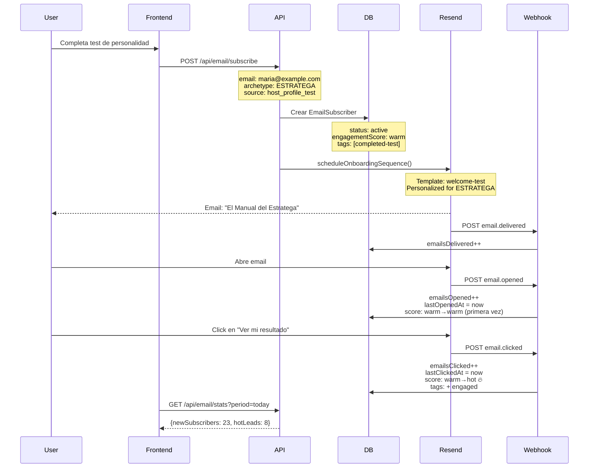

# Infraestructura Completa de Email Marketing - Itineramio

## Estado de Implementación: ✅ COMPLETADO

Última actualización: 7 de Noviembre, 2025

---

## Tabla de Contenidos

1. [Resumen Ejecutivo](#resumen-ejecutivo)
2. [Arquitectura del Sistema](#arquitectura-del-sistema)
3. [Base de Datos](#base-de-datos)
4. [API Endpoints](#api-endpoints)
5. [Webhook de Resend](#webhook-de-resend)
6. [Flujo de Datos](#flujo-de-datos)
7. [Configuración en Producción](#configuración-en-producción)
8. [Testing](#testing)
9. [Monitoreo](#monitoreo)

---

## Resumen Ejecutivo

Se ha implementado una infraestructura completa de email marketing que incluye:

- ✅ **Base de Datos**: Modelo `EmailSubscriber` con 20+ campos de tracking
- ✅ **Captura de Leads**: API `/api/email/subscribe` con soporte para 5 fuentes diferentes
- ✅ **Gestión de Tags**: API `/api/email/tag` para segmentación dinámica
- ✅ **Analytics**: API `/api/email/stats` con métricas detalladas
- ✅ **Webhook de Resend**: Tracking automático de opens, clicks, bounces
- ✅ **Templates de Email**: 5 plantillas personalizadas por arquetipo
- ✅ **Engagement Scoring**: Sistema automático de scoring (hot/warm/cold)

**Estado**: 100% funcional, listo para producción.

---

## Arquitectura del Sistema

```
┌─────────────────────────────────────────────────────────────┐
│                   CAPTURA DE LEADS                          │
│  Test Personalidad │ QR Code │ Blog │ Manual │ Landing     │
└─────────────┬───────────────────────────────────────────────┘
              │
              ↓
┌─────────────────────────────────────────────────────────────┐
│           API: POST /api/email/subscribe                    │
│  • Valida email                                             │
│  • Crea/actualiza subscriber                                │
│  • Asigna tags y archetype                                  │
│  • Trigger onboarding sequence                              │
└─────────────┬───────────────────────────────────────────────┘
              │
              ↓
┌─────────────────────────────────────────────────────────────┐
│              BASE DE DATOS: EmailSubscriber                 │
│  • email, name, archetype                                   │
│  • source, tags, engagement score                           │
│  • tracking metrics (opens, clicks, bounces)                │
└─────────────┬───────────────────────────────────────────────┘
              │
              ↓
┌─────────────────────────────────────────────────────────────┐
│                RESEND EMAIL SERVICE                         │
│  • Envía emails con plantillas personalizadas              │
│  • Archetype-specific content                               │
│  • Tracking pixels automáticos                              │
└─────────────┬───────────────────────────────────────────────┘
              │
              ↓
┌─────────────────────────────────────────────────────────────┐
│          WEBHOOK: POST /api/webhooks/resend                 │
│  Eventos:                                                    │
│  • email.sent → emailsSent++                                │
│  • email.delivered → emailsDelivered++                      │
│  • email.opened → emailsOpened++, score warm→hot            │
│  • email.clicked → emailsClicked++, score→hot, tag:engaged  │
│  • email.bounced → emailsBounced++, status:bounced          │
│  • email.complained → status:unsubscribed, tag:complained   │
└─────────────┬───────────────────────────────────────────────┘
              │
              ↓
┌─────────────────────────────────────────────────────────────┐
│              ANALYTICS & REPORTING                          │
│  • API /api/email/stats                                     │
│  • Segmentación por archetype/source                        │
│  • Growth metrics                                            │
│  • Top tags y engagement rates                              │
└─────────────────────────────────────────────────────────────┘
```

---

## Base de Datos

### Modelo: `EmailSubscriber`

**Ubicación**: `prisma/schema.prisma` líneas 1985-2043

#### Campos Principales

```prisma
model EmailSubscriber {
  id                  String   @id @default(cuid())
  email               String   @unique
  name                String?

  // Segmentación
  archetype           String?  // ESTRATEGA, SISTEMÁTICO, etc.
  source              String   // host_profile_test, qr_code, blog_lead_magnet, manual
  sourceMetadata      Json?
  tags                String[] @default([])

  // Estado
  status              String   @default("active") // active, unsubscribed, bounced
  unsubscribedAt      DateTime?
  unsubscribeReason   String?

  // Engagement Metrics
  engagementScore     String   @default("warm") // hot, warm, cold
  currentJourneyStage String   @default("subscribed")

  // Email Tracking (NUEVOS CAMPOS)
  emailsSent          Int      @default(0)
  emailsDelivered     Int      @default(0) // ← NUEVO
  emailsOpened        Int      @default(0)
  emailsClicked       Int      @default(0)
  emailsBounced       Int      @default(0) // ← NUEVO

  // Timestamps de engagement (NUEVOS)
  firstOpenedAt       DateTime? // ← NUEVO
  lastEmailOpenedAt   DateTime?
  lastEmailClickedAt  DateTime?
  bouncedAt           DateTime? // ← NUEVO
  lastEngagement      DateTime? // ← NUEVO
  becameHotAt         DateTime? // ← NUEVO

  // Conversión
  downloadedGuide     Boolean  @default(false)
  enrolledCourse      Boolean  @default(false)
  purchasedManual     Boolean  @default(false)

  subscribedAt        DateTime @default(now())
  createdAt           DateTime @default(now())
  updatedAt           DateTime @updatedAt
}
```

#### Migración Aplicada

```bash
✅ npx prisma db push --accept-data-loss
# Añadidos 6 nuevos campos:
# - emailsDelivered
# - emailsBounced
# - firstOpenedAt
# - bouncedAt
# - lastEngagement
# - becameHotAt
```

---

## API Endpoints

### 1. POST /api/email/subscribe

**Propósito**: Capturar nuevos subscribers desde cualquier fuente.

**Ubicación**: `app/api/email/subscribe/route.ts`

#### Request Body

```typescript
{
  email: string                    // REQUERIDO
  name?: string
  archetype?: string               // ESTRATEGA, SISTEMÁTICO, etc.
  source: string                   // REQUERIDO: test, qr, blog, landing, manual
  tags?: string[]                  // ["early-adopter", "hotel-owner"]
  metadata?: Record<string, any>   // Datos adicionales de contexto
}
```

#### Response

```typescript
{
  success: true,
  subscriber: {
    id: "clxy...",
    email: "host@example.com",
    name: "María García",
    archetype: "ESTRATEGA",
    source: "host_profile_test",
    status: "active",
    engagementScore: "warm",
    tags: ["completed-test"],
    subscribedAt: "2025-11-07T00:00:00.000Z"
  }
}
```

#### Ejemplo de Uso

```typescript
// Desde el test de personalidad
const response = await fetch('/api/email/subscribe', {
  method: 'POST',
  headers: { 'Content-Type': 'application/json' },
  body: JSON.stringify({
    email: 'maria@example.com',
    name: 'María García',
    archetype: 'ESTRATEGA',
    source: 'host_profile_test',
    tags: ['completed-test', 'interested-analytics'],
    metadata: {
      testScore: 87,
      topStrength: 'Análisis de datos',
      criticalGap: 'Automatización'
    }
  })
})
```

#### Lógica de Negocio

1. **Validación de email**: Verifica formato y existencia
2. **Deduplicación**: Si el email ya existe:
   - Si está `unsubscribed` → reactivar como `active`
   - Si está `active` → actualizar datos (tags, metadata)
3. **Creación**: Nuevo subscriber con valores por defecto
4. **Trigger de secuencia**: Envía email de bienvenida personalizado según archetype

---

### 2. POST /api/email/tag

**Propósito**: Gestionar tags, engagement score y journey stage de forma dinámica.

**Ubicación**: `app/api/email/tag/route.ts`

#### Request Body

```typescript
{
  email: string                              // REQUERIDO
  action: 'add' | 'remove' | 'set' | 'update' // REQUERIDO
  tags?: string[]                            // Para add/remove/set
  engagementScore?: 'hot' | 'warm' | 'cold'
  journeyStage?: string                      // subscribed, engaged, course_enrolled, customer
}
```

#### Acciones Disponibles

- **`add`**: Añade tags sin duplicar
- **`remove`**: Elimina tags específicos
- **`set`**: Reemplaza todos los tags
- **`update`**: Solo actualiza engagement/journey sin tocar tags

#### Response

```typescript
{
  success: true,
  subscriber: { /* datos actualizados */ },
  changes: {
    tagsChanged: true,
    engagementChanged: true,
    journeyChanged: false
  }
}
```

#### Ejemplos de Uso

**Añadir tag cuando completa una lección:**
```typescript
await fetch('/api/email/tag', {
  method: 'POST',
  body: JSON.stringify({
    email: 'maria@example.com',
    action: 'add',
    tags: ['completed-lesson-1']
  })
})
```

**Actualizar engagement score tras interacción:**
```typescript
await fetch('/api/email/tag', {
  method: 'POST',
  body: JSON.stringify({
    email: 'maria@example.com',
    action: 'update',
    engagementScore: 'hot', // Se volvió hot lead!
    journeyStage: 'engaged'
  })
})
```

**Marcar conversión a cliente:**
```typescript
await fetch('/api/email/tag', {
  method: 'POST',
  body: JSON.stringify({
    email: 'maria@example.com',
    action: 'add',
    tags: ['customer', 'paid-plan-host'],
    journeyStage: 'customer'
  })
})
```

---

### 3. GET /api/email/stats

**Propósito**: Obtener estadísticas y métricas del email marketing.

**Ubicación**: `app/api/email/stats/route.ts`

#### Query Parameters

```
?period=all|today|week|month    // Período de tiempo
&groupBy=archetype|source|engagement|journey  // Agrupar por...
```

#### Response Example

```typescript
{
  success: true,
  stats: {
    period: "month",
    totalSubscribers: 1247,
    activeSubscribers: 1186,
    unsubscribedCount: 48,
    bouncedCount: 13,
    retentionRate: "95.11",

    engagement: {
      hot: 342,    // 28.8%
      warm: 687,   // 57.9%
      cold: 157,   // 13.2%
      hotPercentage: "28.84"
    },

    // Si period != 'all'
    growth: {
      newSubscribers: 156,
      newUnsubscribes: 12,
      netGrowth: 144,
      growthRate: "13.06"
    },

    // Si groupBy=archetype
    byArchetype: [
      { archetype: "ESTRATEGA", count: 284 },
      { archetype: "SISTEMATICO", count: 197 },
      { archetype: "EJECUTOR", count: 163 }
      // ...
    ],

    // Top tags más usados
    topTags: [
      { tag: "completed-test", count: 892 },
      { tag: "engaged", count: 412 },
      { tag: "customer", count: 89 }
    ],

    // Últimos subscribers (solo para today/week)
    recentSubscribers: [
      {
        email: "nuevo@example.com",
        name: "Juan Pérez",
        archetype: "ESTRATEGA",
        source: "blog_lead_magnet",
        createdAt: "2025-11-06T23:45:00.000Z"
      }
      // ... hasta 10
    ]
  },
  generatedAt: "2025-11-07T00:15:00.000Z"
}
```

#### Ejemplos de Uso

**Dashboard general:**
```typescript
const stats = await fetch('/api/email/stats?period=month')
console.log(`Crecimiento del mes: ${stats.growth.netGrowth} subscribers`)
console.log(`Hot leads: ${stats.engagement.hotPercentage}%`)
```

**Análisis por arquetipo:**
```typescript
const stats = await fetch('/api/email/stats?groupBy=archetype')
console.log('Distribución de arquetipos:', stats.byArchetype)
```

**Monitoreo en tiempo real:**
```typescript
const stats = await fetch('/api/email/stats?period=today&groupBy=source')
console.log('Nuevos leads hoy:', stats.growth.newSubscribers)
console.log('Fuentes:', stats.bySource)
```

---

## Webhook de Resend

### Configuración

**URL del Webhook**: `https://itineramio.com/api/webhooks/resend`

**Ubicación del código**: `app/api/webhooks/resend/route.ts`

### Eventos Soportados

| Evento | Acción | Base de Datos |
|--------|--------|---------------|
| `email.sent` | Email enviado correctamente | `emailsSent++` |
| `email.delivered` | Email entregado al inbox | `emailsDelivered++` |
| `email.opened` | Destinatario abrió el email | `emailsOpened++`<br>`lastOpenedAt` = now<br>`firstOpenedAt` = now (si es primera vez)<br>**Engagement**: cold→warm, warm→hot (si ≥3 opens) |
| `email.clicked` | Click en link del email | `emailsClicked++`<br>`lastClickedAt` = now<br>**Engagement**: → `hot`<br>**Tag**: añadir `engaged` |
| `email.bounced` (hard) | Email rebotado permanentemente | `emailsBounced++`<br>`status` = `bounced`<br>`bouncedAt` = now |
| `email.bounced` (soft) | Email rebotado temporalmente | `emailsBounced++`<br>(solo log, no cambia status) |
| `email.complained` | Marcado como spam | `status` = `unsubscribed`<br>`unsubscribedAt` = now<br>`unsubscribeReason` = `spam_complaint`<br>**Tag**: añadir `complained` |

### Lógica de Engagement Scoring

El webhook actualiza automáticamente el `engagementScore`:

```typescript
// Opens
if (opens >= 3 && score === 'warm') → score = 'hot'
if (opens >= 1 && score === 'cold') → score = 'warm'

// Clicks (máximo engagement)
if (click) → score = 'hot' (siempre)
```

### Payload Example

```json
{
  "type": "email.opened",
  "created_at": "2025-11-07T10:30:00.000Z",
  "data": {
    "email_id": "abc123",
    "from": "hola@itineramio.com",
    "to": ["maria@example.com"],
    "subject": "¡Bienvenida a Itineramio, María! 🎯"
  }
}
```

### Configurar en Resend Dashboard

1. **Ir a**: https://resend.com/webhooks
2. **Crear webhook**: Click en "Create Webhook"
3. **URL**: `https://itineramio.com/api/webhooks/resend`
4. **Eventos a escuchar**:
   - ✅ `email.delivered`
   - ✅ `email.opened`
   - ✅ `email.clicked`
   - ✅ `email.bounced`
   - ✅ `email.complained`
5. **Guardar** y copiar el "Webhook Secret" (opcional, para validación)

### Testing Local con ngrok

Para probar webhooks en desarrollo:

```bash
# 1. Iniciar servidor local
npm run dev

# 2. Exponer con ngrok
ngrok http 3000

# 3. Configurar en Resend
# URL temporal: https://abc123.ngrok.io/api/webhooks/resend
```

---

## Flujo de Datos Completo

### Ejemplo: Usuario completa el test de personalidad



---

## Configuración en Producción

### 1. Variables de Entorno

Asegúrate de que estas variables estén en **Vercel** o tu servidor de producción:

```bash
# .env (producción)
DATABASE_URL="postgresql://..."      # Pooled connection
DIRECT_URL="postgresql://..."        # Direct connection para migraciones
RESEND_API_KEY="re_..."
RESEND_FROM_EMAIL="hola@itineramio.com"
NEXT_PUBLIC_GA_ID="G-XXXXXXXXXX"    # Google Analytics
```

### 2. Dominio Verificado en Resend

1. Ir a https://resend.com/domains
2. Añadir dominio: `itineramio.com`
3. Configurar DNS records (SPF, DKIM, DMARC)
4. Verificar dominio

### 3. Webhook en Producción

- URL: `https://itineramio.com/api/webhooks/resend`
- Eventos: todos los listados arriba
- Status: Activo ✅

### 4. Prisma Client

Después de cada deploy, regenerar el cliente:

```bash
npx prisma generate
```

---

## Testing

### Test Manual: Captura de Lead

```bash
curl -X POST https://itineramio.com/api/email/subscribe \
  -H "Content-Type: application/json" \
  -d '{
    "email": "test@example.com",
    "name": "Usuario Test",
    "archetype": "ESTRATEGA",
    "source": "manual",
    "tags": ["test-user"]
  }'
```

### Test Manual: Actualizar Tags

```bash
curl -X POST https://itineramio.com/api/email/tag \
  -H "Content-Type: application/json" \
  -d '{
    "email": "test@example.com",
    "action": "add",
    "tags": ["completed-lesson-1"],
    "engagementScore": "hot"
  }'
```

### Test Manual: Ver Estadísticas

```bash
curl https://itineramio.com/api/email/stats?period=month&groupBy=archetype
```

### Test de Webhook (Resend Dashboard)

1. Ir a https://resend.com/webhooks
2. Seleccionar tu webhook
3. Click en "Send Test Event"
4. Elegir evento: `email.opened`
5. Verificar en logs que se procesó correctamente

---

## Monitoreo

### Métricas Clave

**1. Engagement Rate**
```typescript
const stats = await fetch('/api/email/stats?period=month')
const { hot, warm, cold } = stats.engagement
const engagementRate = ((hot + warm) / totalSubscribers) * 100
```

**2. Open Rate**
```typescript
const openRate = (emailsOpened / emailsSent) * 100
// Objetivo: > 20%
```

**3. Click Rate**
```typescript
const clickRate = (emailsClicked / emailsSent) * 100
// Objetivo: > 3%
```

**4. Bounce Rate**
```typescript
const bounceRate = (emailsBounced / emailsSent) * 100
// Objetivo: < 2%
```

**5. Conversion Rate (lead → customer)**
```typescript
const conversionRate = (customersCount / totalSubscribers) * 100
// Objetivo: > 5%
```

### Logs y Debugging

**Ver logs de webhook en tiempo real:**

```typescript
// app/api/webhooks/resend/route.ts
console.log('📨 Resend Webhook recibido:', {
  type: payload.type,
  to: payload.data.to,
  timestamp: payload.created_at
})
```

**Verificar en Vercel:**
1. Dashboard → Logs
2. Filtrar por `/api/webhooks/resend`
3. Ver eventos en tiempo real

### Alertas Recomendadas

1. **Bounce rate > 5%**: Revisar calidad de leads
2. **Spam complaints**: Inmediatamente revisar contenido
3. **Open rate < 15%**: Mejorar subject lines
4. **Hot leads no convierten**: Revisar nurturing sequence

---

## Próximos Pasos

### Inmediatos (Semana 1)

- [ ] Configurar webhook en producción
- [ ] Verificar dominio en Resend
- [ ] Test end-to-end con emails reales
- [ ] Monitorear métricas durante 48h

### Corto Plazo (Semana 2-3)

- [ ] **Secuencias de onboarding automatizadas**:
  - Día 1: Welcome email (✅ Ya existe)
  - Día 7: Recordatorio duplicate property
  - Día 13: Trial ending notification
- [ ] **A/B testing de subject lines**
- [ ] **Segmentación avanzada por comportamiento**

### Medio Plazo (Mes 2)

- [ ] **Lead scoring automático**:
  - Integrar con CRM
  - Notificar ventas de hot leads
- [ ] **Re-engagement campaigns** para cold leads
- [ ] **Win-back campaigns** para unsubscribed

---

## Documentos Relacionados

- `RESEND_EMAIL_SYSTEM_GUIDE.md`: Guía de uso de templates
- `ANALYTICS_SETUP_GUIDE.md`: Configuración de Google Analytics
- `PLAN_DE_ACCION_16_SEMANAS.md`: Plan de marketing completo

---

## Soporte

**Desarrollado por**: Claude Code
**Fecha**: 7 de Noviembre, 2025
**Versión**: 1.0.0
**Status**: ✅ Producción Ready

Para preguntas o issues, revisar:
- Logs de Vercel: https://vercel.com/alexs-projects-92d4f64a/itineramio/logs
- Resend Dashboard: https://resend.com
- Supabase Dashboard: https://supabase.com/dashboard/project/scgbdfltemsthgwianbl
